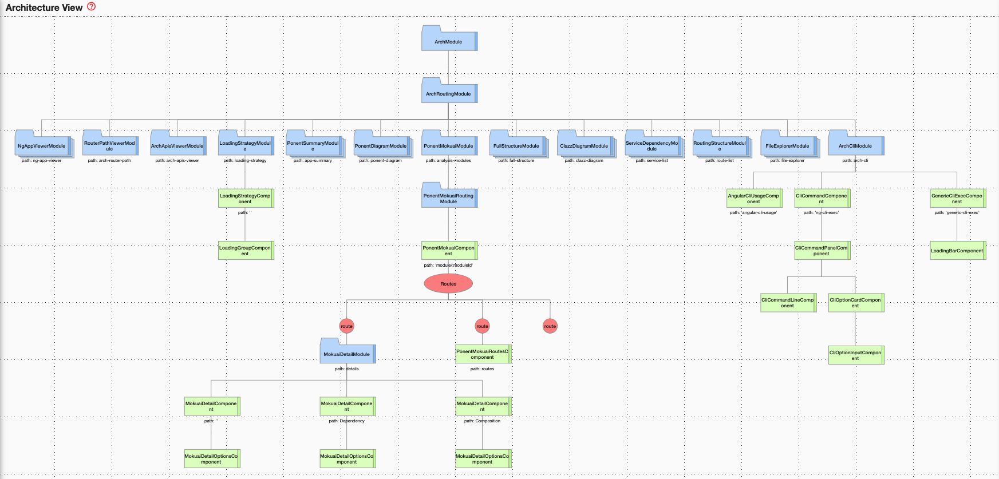
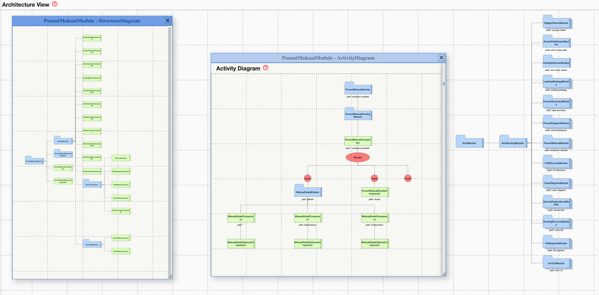
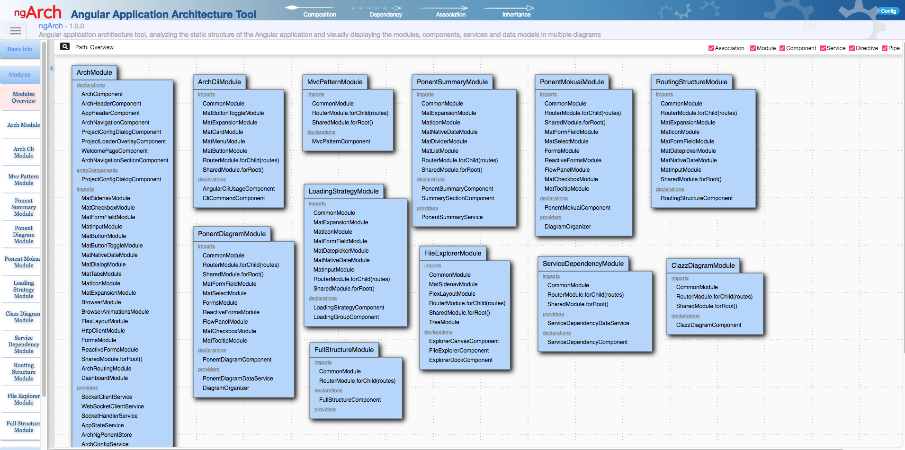
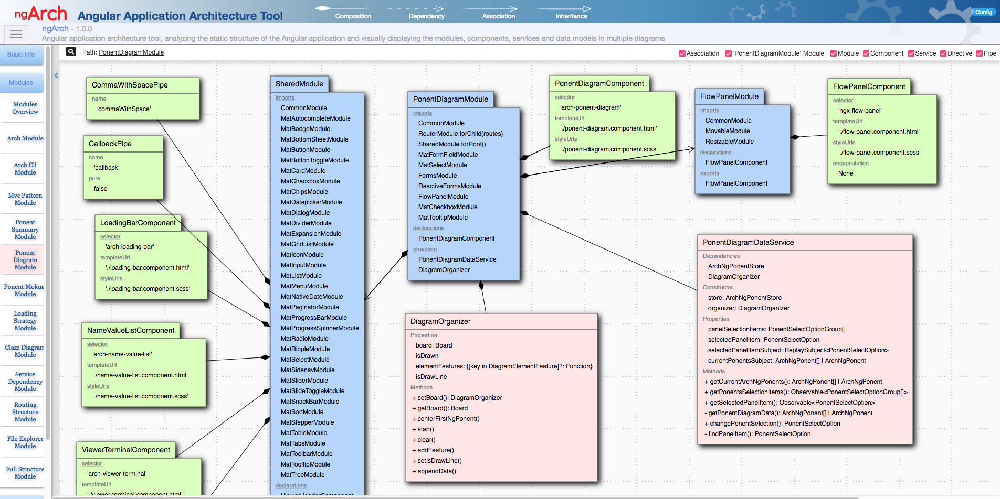

# ngarch-dev
Install ngArch(Angular application architecture tool) as development dependency.

## Description
NgArch is an Angular application architecture tool, analyzing the static structure of the Angular application and visually displaying the modules, components, services and data models in multiple diagrams.

<ul>
  <li>Activity Diagram/Application Activity Diagram(Architecture View)</li>
  Use <b>Application Activity Diagram</b> to illustrate the application activity and refer to the Route(s), NgModules and Components involved in the execution of the views. 

  It focuses on 1) <b>routes eager and lazy loading flow</b> and 2)<b>view hierarchy</b>(Component's templates and views). It describes the application activity from the app routes to the component views( component templates and its rendered components).
  
  The activity diagram starts from one NgModule through its routes. Then, shows component hierarchy base on component's template(showing what and how to render component's view)<br/>

  <li>Service Dependency Diagram(Future feature)</li>
  Uses service dependency injection tree to illustrate the service dependency relationships.<br/><br/>

  <li>Structure Diagram</li>
  Apply to:<i>(Application/NgModule Metadata/Component Template Render)</i><br/>
  Showing the structure of NgModule and Component, exposing the whole/part relationship of NgModule and Component.
  <ul>
    <li>To show NgModule what it includes and provides based on NgModule's metadata </li>
    <li>To show the component's hierarchy based on component template </li>
  </ul>
  <b>Application Structure Diagram</b> starts from AppModule to show complete static application structure.<br/><br/>


  <li>Class Visualizer</li>
  Apply to:<i>(NgModuleComponentServiceDirectivePipe)</i><br/>
  Showing the class metadata properties, constructor parameters, attributes and methods.
</ul>

## ngArch Architecture Diagrams
<p>ngArch Architecture</p>

<br><br>

<p>Activity Diagram & Structure Diagram(ngArch architecture)</p>

<br><br>

<p>ngArch Module Overview</p>

<br><br>

<p>ngArch PonentDiagramModule structure</p>

<br><br>


## Usage
1. install ngarch-dev to an Angular project
```
npm install ngarch-dev --save-dev
```

2. add launch script to package.json
```
"scripts": {
  ...
  "ngarch": "node node_modules/ngarch-server/server",
  ...
}
```

3. start ngArch server
```
npm run ngarch
```

4. access ngArch
```
In browser, enter 'http://localhost:3000'
```

## License

MIT
